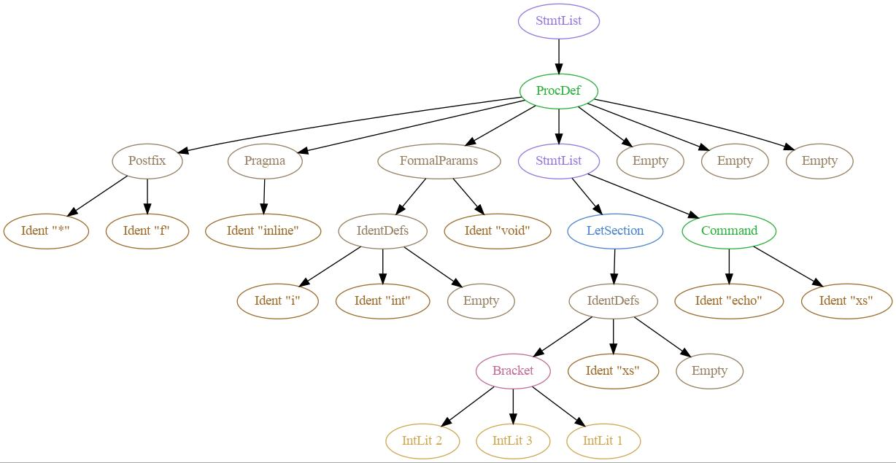

# Astdot

Print a dot graph of a nim ast dumped using the `dumpTree` macro.

---

## View image

To view output in fim:
`astdot | dot -Tjpg | fim -i --autowindow`

## Feed output from `dumpTree`

Force recompile (to reprint macros) and pipe into astdot:
`nim r -f src/example.nim | astdot`

## Pipe clipboard

With xclip to paste from clipboard:
`xclip -selection clipboard -o | astdot`
